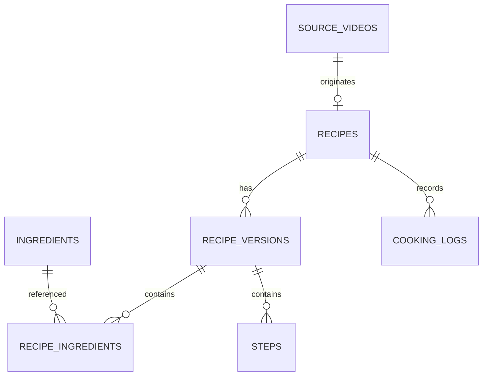

# 数据模型

建议使用 PostgreSQL（Supabase 托管）。下表是首版逻辑结构，开发时再生成正式 SQL migration。

| 表 | 关键字段 | 用途 |
|---|---|---|
| profiles | id, display_name, locale | 用户资料 |
| source_videos | id, bvid, url, title, uploader, cover_url, description, favorite_id, fetched_at, status | B 站来源元数据 |
| recipes | id, owner_id, source_video_id, title, summary, servings, prep_minutes, cook_minutes, difficulty, status, visibility | 菜谱主体 |
| recipe_versions | id, recipe_id, version_no, version_type, change_note, created_at | 来源版、当前个人版及历史版本 |
| ingredients | id, name_zh, name_en, name_de, aliases, allergen_notes, gluten_status, verified | 食材词典 |
| recipe_ingredients | version_id, ingredient_id, amount, unit, preparation, optional, group_name, sort_order | 某版本的食材和用量 |
| tools | id, name_zh, name_en, name_de | 厨具词典 |
| recipe_tools | version_id, tool_id, optional, note | 菜谱所需厨具 |
| steps | id, version_id, step_no, instruction, duration_minutes, temperature_c, tips | 分步做法 |
| tags | id, group_name, name, description | 分类和筛选标签 |
| recipe_tags | recipe_id, tag_id, source, confidence, confirmed | 菜谱多标签 |
| substitutions | id, ingredient_id, substitute_id, market, ratio, note, verified | 德国等市场的替代关系 |
| cooking_logs | id, recipe_id, cooked_at, rating, result, changes, lessons, private | 每次做菜记录 |
| media | id, owner_id, recipe_id, cooking_log_id, storage_path, caption, sort_order | 自己上传的图片 |
| share_links | id, resource_type, resource_id, token, expires_at, active | 只读分享 |
| import_jobs | id, source, favorite_id, started_at, finished_at, status, summary | 导入批次 |
| import_items | id, job_id, external_id, status, error, raw_metadata | 单视频导入结果 |

## 重要约束

- source_videos.bvid 唯一，防止重复导入。
- 菜谱可以没有来源视频，方便以后添加自创菜。
- 删除来源视频不能级联删除个人菜谱。
- AI 提取和翻译结果必须有 confirmed/verified 状态。
- 私人做菜日志不得出现在公开分享接口。
- 图片只存对象存储路径，不把二进制放入数据库或 Git。
- 所有数据库变更通过 migration 记录在 GitHub。
- 数据导出至少支持 JSON/CSV，避免被单一平台锁定。

## 版本关系

## 备份策略

- GitHub：结构、migration、初始词典、文档和脱敏样例。
- Supabase：启用平台备份；另外定期导出数据库。
- 图片：保留对象存储备份或可重新上传的本地原图。
- B 站来源：保存 BV 号和必要元数据；即使视频失效，也保留自己的菜谱和日志。
