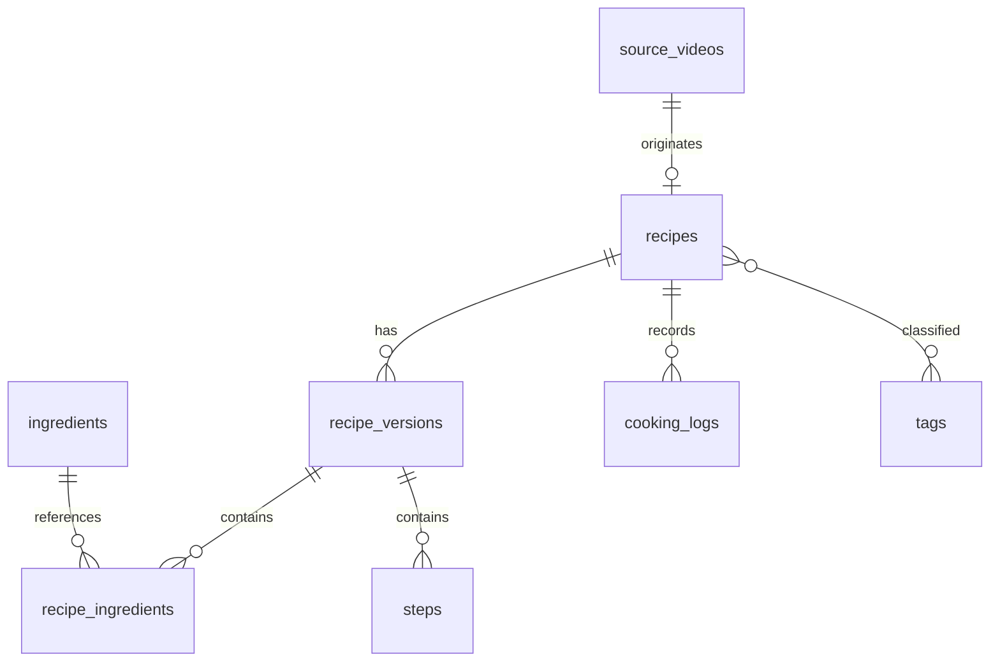

# CookingApp V1 数据库设计

本文是第一版可直接落地的 PostgreSQL / Supabase 逻辑规格。设计重点是把“来源视频”“我认可的当前菜谱”和“每次实际制作记录”分开，避免以后修改菜谱时丢失来源与历史。

## 1. 设计原则

- GitHub 保存代码、migration、文档与公开种子数据；业务数据保存到 Supabase PostgreSQL。
- B 站视频只保存链接和公开元数据，不复制视频文件。
- 一道菜可没有来源视频，也可拥有多个历史版本。
- AI 提取、翻译、标签和过敏原判断都必须记录确认状态。
- 公开分享接口默认排除私人日志、导入原始数据和用户信息。
- 首版结构为购物清单、周菜单和 Open Food Facts 对接预留稳定主键，但不实现完整业务。
- V2 起新增的 OCR/采购数据继续遵循“原始证据、AI/模型候选、人工确认后的业务事实”分层，不能把模型输出直接当作确定事实。

## 2. 核心关系



## 3. V1 表清单

| 表 | 关键字段 | 作用 | 首版状态 |
|---|---|---|---|
| profiles | id, display_name, locale, timezone | 用户资料与区域偏好 | 实现 |
| source_videos | id, platform, external_id, url, title, uploader_name, cover_url, description, published_at, availability | 视频来源元数据 | 实现 |
| import_jobs | id, owner_id, source, source_collection_id, status, counters, started_at, finished_at | 一次收藏夹导入 | 实现 |
| import_items | id, job_id, external_id, status, error_code, raw_metadata | 每条导入结果与重试 | 实现 |
| recipes | id, owner_id, source_video_id, title, summary, servings, total_minutes, difficulty, status, visibility, current_version_id | 菜谱入口和当前版本指针 | 实现 |
| recipe_versions | id, recipe_id, version_no, version_type, change_note, created_by, created_at | 来源版、个人版、历史快照 | 实现 |
| ingredients | id, canonical_name_zh, name_en, name_de, aliases, category, gluten_status, allergen_notes, verification_status | 中英德食材词典 | 实现 |
| recipe_ingredients | id, version_id, ingredient_id, display_name, amount, unit, preparation, optional, group_name, sort_order | 版本所需食材 | 实现 |
| tools | id, name_zh, name_en, name_de, aliases | 厨具词典 | 实现 |
| recipe_tools | version_id, tool_id, optional, note | 版本所需厨具 | 实现 |
| steps | id, version_id, step_no, instruction, duration_minutes, temperature_c, media_id, tips | 结构化步骤 | 实现 |
| tags | id, group_name, slug, name, description | 多维标签词典 | 实现 |
| recipe_tags | recipe_id, tag_id, source, confidence, confirmed | 菜谱标签关系 | 实现 |
| substitutions | id, ingredient_id, substitute_id, market, ratio_text, store_hint, note, verification_status | 德国市场替代品 | 实现 |
| cooking_logs | id, recipe_id, cooked_at, rating, result_status, changes, lessons, next_time, private | 每次实际制作记录 | 实现 |
| media | id, owner_id, recipe_id, cooking_log_id, storage_path, media_type, caption, sort_order | 成品/过程图片 | 实现 |
| share_links | id, owner_id, resource_type, resource_id, token_hash, expires_at, active | 只读分享 | 实现 |
| external_food_refs | id, ingredient_id, provider, external_id, url, last_synced_at | Open Food Facts 等外部引用 | 仅预留 |

### V2 已实施补充表

| 表 | 关键字段 | 作用 | 状态 |
|---|---|---|---|
| user_roles | user_id, role | 独立于用户可编辑 profile 的管理员角色 | DEV / PROD 已实施 |
| recipe_publication_requests | recipe_id, owner_id, snapshot, status, reviewed_by | 私人菜谱公开申请与审核 | DEV / PROD 已实施 |
| public_recipes | recipe_id, publication_request_id, snapshot | 审核通过后的公开白名单快照 | DEV / PROD 已实施 |
| public_recipe_likes | recipe_id, user_id | 公开菜谱账号级点赞 | DEV / PROD 已实施 |
| pantry_items | owner_id, canonical_key, document | 账号级线上冰箱 | DEV / PROD 已实施 |
| feedback_submissions | owner_id, category, title, details, context, status, priority, reviewed_by | 用户反馈与管理员审核队列 | 2026-08-22 DEV / PROD 已实施 |

## 4. 枚举与业务约束

### 菜谱状态

`inbox`（只导入）、`to_try`（准备尝试）、`successful`（已成功）、`needs_work`（需改进）、`favorite`（常做）、`archived`（归档）。

### 版本类型

`source_extracted`（从来源整理）、`personal_current`（当前个人版）、`snapshot`（历史快照）。更新当前个人版时先生成 snapshot，再更新 `recipes.current_version_id`。

### 校验状态

`unverified`、`ai_suggested`、`user_verified`、`source_verified`。无麸质、过敏原、用量、温度和营养数据不得仅凭 `ai_suggested` 作为确定结论展示。

### 数据库约束

- `source_videos(platform, external_id)` 唯一，重复导入采用 upsert。
- `recipe_versions(recipe_id, version_no)` 唯一。
- `steps(version_id, step_no)` 唯一，`step_no > 0`。
- 评分限制为 1–5；时间、用量和温度允许空值但不能为负。
- 删除来源视频时菜谱保留，`source_video_id` 置空。
- 删除菜谱时媒体先从对象存储安全清理，再删除数据库记录。
- 所有用户表都包含 `created_at`、`updated_at`；需要软删除的主表增加 `deleted_at`。

## 5. 权限设计（RLS）

| 数据 | 所有者 | 登录用户 | 匿名分享访问者 |
|---|---|---|---|
| 私人菜谱与版本 | 读写 | 仅自己的 | 不可见 |
| 公开/链接分享菜谱 | 读写 | 按权限读取 | 仅公开视图字段 |
| cooking_logs | 读写 | 仅自己的 | 永不返回 |
| import_jobs / raw_metadata | 读写 | 仅自己的 | 永不返回 |
| feedback_submissions | 管理员审核全体 | 用户提交并读取自己的 | 永不可见 |
| 公共食材词典 | 可维护 | 只读 | 只读 |

分享页面通过受控数据库函数或服务端查询返回白名单字段，不能把 token 当作绕过 RLS 的万能权限。

## 6. 搜索与索引

- `recipes(owner_id, status, updated_at desc)` 支持首页和状态筛选。
- `source_videos(platform, external_id)` 支持去重。
- `recipe_tags(tag_id, recipe_id)` 支持多标签筛选。
- `recipe_ingredients(ingredient_id, version_id)` 支持“现有食材能做什么”。
- 菜名、摘要、中英德食材名建立 PostgreSQL 全文或 trigram 索引。
- 首版不引入向量数据库；数据量和真实搜索问题证明有需要后再评估。

## 7. Migration 文件顺序

```text
supabase/migrations/
  0001_extensions.sql
  0002_profiles_and_rls.sql
  0003_sources_and_imports.sql
  0004_recipes_and_versions.sql
  0005_ingredients_tools_steps.sql
  0006_tags_and_search.sql
  0007_logs_media_sharing.sql
  0008_seed_reference_data.sql
```

每个 migration 必须可重复部署到空数据库；种子数据使用稳定 slug，不在 SQL 中保存私人收藏数据。

## 8. V2 计划扩展：德国小票 OCR、采购事实与市场别名

> 状态：**数据库设计草案，尚未生成/执行 migration。** 实际 DEV / PROD 同步状态以 [`03_dev_prod_database_sync.md`](./03_dev_prod_database_sync.md) 为准。

### 8.1 分层原则

```text
小票图片 / OCR provider 原始输出
          ↓
shopping_receipts + receipt_ocr_runs
          ↓
shopping_receipt_items（候选，允许错误/空字段）
          ↓
ingredient_market_aliases → ingredients.id
          ↓
用户确认
          ↓
purchase_records（可被成本/库存使用的事实）
```

这样可以同时支持：

- Web 后端 PaddleOCR；
- 未来 iOS Apple Vision；
- 未来 Android/iOS ML Kit；
- 人工录入；
- 同一张小票比较不同识别器，不覆盖历史结果。

### 8.2 计划表

#### `shopping_receipts`

建议字段：

- `id uuid primary key`
- `owner_id uuid not null`
- `store_name text`
- `store_country text default 'DE'`
- `purchased_at timestamptz`
- `currency text default 'EUR'`
- `total_amount numeric`
- `media_id uuid null`
- `status text`：`uploaded / parsed / needs_review / confirmed / archived`
- `created_at / updated_at`

用途：代表一张真实小票。原图通过私有 Storage / `media` 引用，不进入公开分享。

#### `receipt_ocr_runs`

建议字段：

- `id uuid primary key`
- `owner_id uuid not null`
- `receipt_id uuid not null`
- `provider text`：`paddleocr / apple_vision / mlkit / manual / other`
- `model_version text`
- `preprocess_version text`
- `raw_text text`
- `raw_result jsonb`
- `latency_ms integer`
- `created_at`

用途：记录一次识别实验，便于比较服务端与设备端结果，也便于以后重新跑模型而不覆盖旧结果。

#### `shopping_receipt_items`

建议字段：

- `id uuid primary key`
- `owner_id uuid not null`
- `receipt_id uuid not null`
- `ocr_run_id uuid null`
- `raw_text text not null`
- `raw_product_name text`
- `ingredient_id uuid null`
- `quantity numeric null`
- `quantity_unit text null`
- `package_amount numeric null`
- `package_unit text null`
- `unit_price numeric null`
- `line_total numeric null`
- `bbox jsonb null`
- `confidence numeric null`
- `verification_status text`：`unverified / user_verified / rejected`
- `created_at / updated_at`

用途：保存模型从小票中提出的“候选商品行”。未知字段允许 `null`，不能为了凑结构伪造数值。

#### `purchase_records`

建议字段：

- `id uuid primary key`
- `owner_id uuid not null`
- `ingredient_id uuid not null`
- `source_receipt_item_id uuid null`
- `store_name text`
- `purchased_at timestamptz`
- `currency text`
- `quantity numeric null`
- `unit text null`
- `package_amount numeric null`
- `package_unit text null`
- `total_price numeric null`
- `verification_status text`
- `created_at / updated_at`

用途：统一保存已经确认、可以参与成本计算的采购事实。以后人工输入价格也可以直接写这里，而不必伪造小票。

#### `ingredient_market_aliases`

建议字段：

- `id uuid primary key`
- `ingredient_id uuid not null`
- `country_code text`
- `locale text`
- `store_name text null`
- `alias text not null`
- `source text`
- `verification_status text`
- `last_seen_at timestamptz`
- `created_at / updated_at`

用途：将德国超市小票里的商品名/缩写映射回现有 canonical `ingredients.id`，再由显示层选择简中、台湾繁中、英文或德文名称。不要为同一个土豆/馬鈴薯/Kartoffel 创建多个 ingredient 实体。

### 8.3 计划索引和约束

- `shopping_receipts(owner_id, purchased_at desc)`；
- `receipt_ocr_runs(receipt_id, created_at desc)`；
- `shopping_receipt_items(receipt_id, verification_status)`；
- `shopping_receipt_items(ingredient_id)`；
- `purchase_records(owner_id, purchased_at desc)`；
- `purchase_records(ingredient_id, purchased_at desc)`；
- `ingredient_market_aliases(country_code, lower(alias))` 使用合适的唯一/近似搜索策略；
- 金额、数量不得为负；`confidence` 若保存为 0–1 则加 check constraint；
- 删除小票时如何保留已经确认的 `purchase_records` 必须在 migration 前明确：建议采购事实保留，来源引用置空或采用受控软删除。

### 8.4 RLS 计划

- `shopping_receipts`、`receipt_ocr_runs`、`shopping_receipt_items`、`purchase_records`：owner-only；
- 小票原图、raw OCR JSON 永不进入匿名公开接口；
- `ingredient_market_aliases` 分为“公共审校词条”和“用户私有经验”时，不要用一个宽松 policy 混在一起；实现前决定增加 `owner_id nullable` 还是拆公共/个人表；
- 所有从 OCR 到库存/成本的写入必须经过已认证用户和确认动作，不能允许匿名识别结果触发业务更新。

### 8.5 Migration 门禁

1. 先在代码中冻结 `ReceiptOcrDraft` / purchase 数据契约；
2. 写 migration；
3. 只在 DEV 执行；
4. 加 RLS、FK、索引和数据校验测试；
5. 把 `03` 中对应计划项改成 `待同步 PROD`；
6. DEV 实机确认后再同步 PROD；
7. 发布 Sites 前再次检查 `03` 无待同步项。
